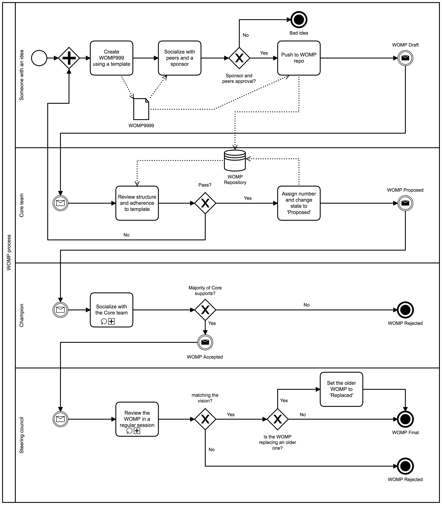
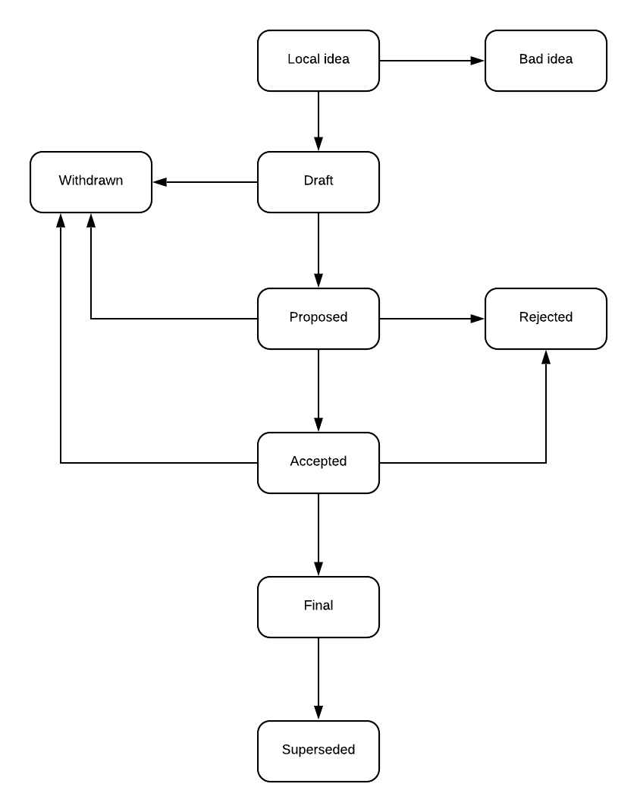

```
WOMP: 9999
Title: WOMP Purpose and Guidelines
Author: Vlad Mettler <vlad.mettler@2sixty.io>
Champion: Vlad Mettler
Status: Draft
Type: Process
Created: 2019-11-12
```

# What is a WOMP

WOMP stands for WPP.Open Modification Proposal. A WOMP is a document providing the WPP.Open community with information on proposed changes to standards that the community agreed to adhere to.
WOMP is the primary document to communicate changes to:
- Processes
- Architecture patterns
- Shared technology choices

# WOMP Audience

The primary audience is the body comprised of technology and product leaders of companies actively participating in WPP.Open. This primary audience is expected to be the source of WOMPs.
Secondary audience is all the WPP.Open participating companies. Everyone needs to be able to see what criteria they need to adhere to in order to be a part of the WPP.Open.

# WOMP Types

## Standard

A change or introduction of an architecture pattern, implementation guidance, technology choice.

## Information

Guidance on how to use architecture patterns, implementation and technology gotchas.

## Process

A change or introduction of a process

# WOMP Workflow

## WPP.Open steering council

“Steering Council” or “Council” refers to a group of people elected to manage the choices driven by the WOMPs. The election process and the membership is defined and published in WOMP 0002. There are always 5 Council members.

## Core developers

“Core developers” refers to product and technology leaders responsible for:
Electing the “Steering Council” members
Development and sponsorship of WOMPs
Implementation of WOMP mandates choices and processes
Membership is granted by invite from the Council.

## WOMP editors

Core developers will invite “WOMP editors” who usually will be members of their teams. The WOMP editors have the ability and rights to edit and maintain WOMPs to which they have been invited. Editors are not considered to be automatically granted the ‘Core’ status.

## WOMP lifecycle

The WOMP process starts with a new idea for a WPP.Open standard, process or information. Each proposal must have a focused scope on a single idea.
Each WOMP needs a Champion who is responsible for preparing, maintaining, socializing, and driving the WOMP through the process. It is a good practice to socialize the idea before submitting the WOMP through appropriate channels. These channels will be defined in WOMP0003. This process is necessary to check if the idea is WOMPable and if it will get enough traction to get incorporated. At this stage the WOMP is in a Draft format.

WOMPs are stored in a repository. Each new WOMP starts its life on its own branch and is numbered as WOMP9999. A pull request is raised. Steering council will regularly review these PRs. If the draft is found to be satisfactory it will be assigned a WOMP number and its status changed to ‘Proposed’. This starts a review process driven by the Champion. The review process needs to give all the Core members enough time to have a discussion about the proposal and make appropriate amendments. The amendments are implemented by the Champion.

After the consultation period, WOMP is voted in by a majority of the Council and moved to a ‘Final’ state.

The following diagram defines this process.



[diagram source](./womp-9999/WOMP_process.bpmn)

The following state machine defines the possible statuses and transitions for a WOMP.



# What belongs in a successful WOMP

## Header

```
WOMP: <womp number>
  Title: <womp title>
  Author: <list of authors' real names and optionally, email addrs>
* Champion: <real name of champion>
  Status: <Draft | Proposed | Accepted | Final | Superseded | Rejected | Withdrawn>
  Type: <Standard | Informational | Process>
* Requires: <womp numbers>
  Created: <date created on, in yyyy-mm-dd format>
* Replaces: <womp number>
* Superseded-By: <womp number>
* Resolution: <url>
```

Fields marked with “*” are optional.

## Body

The body of WOMP is not standardised, but it is suggested that you should provide at least three sections:
- Context - outlining the problem and its surroundings
- Solution/Decision - outlining how to address the problem
- Impact - positive, neutral and negative effects and side effects

## Additional files

A WOMP may need additional files. Such files should be named `womp-XXXX-Y.ext`, where `XXXX` is the WOMP number, `Y` is a serial number (starting at 1), and `ext` is replaced by an actual extension.
Alternatively, supporting files may be placed in a subdirectory called `womp-XXXX`, where `XXXX` is the WOMP number. There are no name constraints in a subdirectory.

